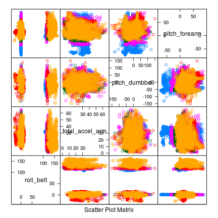

##  Some preprocessing of data


**Goal**: The aim of this course project is to predict the type of exercise 
performed by test  from the measurements of fitness devices.

Looking at the column names of the data it is obvious that some columns report 
"non-features" like usernames or timestamps and others give summary properties
like average pitch of forearm or similar. In a first preprocessing step I clean
the data of those columns as they are either not available for single test cases
or should not contribute to the prediction (unless user Jeremy always performs
the same exercise but that would defeat the purpose of predicting from device
measurements).

```r
nonfeaturesindices <- c(1:7, grep("kurtosis", colnames(data)), grep("skewness", colnames(data)),
                        grep("max", colnames(data)), grep("min", colnames(data)), 
                        grep("amplitude", colnames(data)), grep("var", colnames(data)), 
                        grep("stddev", colnames(data)), grep("avg", colnames(data))
                        )
data <- data[-nonfeaturesindices]
```

---

## Splitting into test and training set

The cleaned data are then split into 60% training and 40% test set. All further 
feature selection and cross validation will be done on the training set and the 
test set will only be used for final validation and error estimation.

```r
set.seed(1234)
inTrain <- createDataPartition(data$classe, p = 0.6, list = FALSE)
training <- data[inTrain,]
testing <- data[-inTrain,]
```

---&twocol w1:40% w2:60%

## First overview of features

There are still 52 possible prediction criteria left but many of them are
correlated. This makes it very hard to choose good features by looking at plots.
Here is a paired feature plot for one measure on the belt, arm, dumbbell and
forearm each.

*** =left
 

*** =right
The objective in feature selection would be to split the differently coloured 
clouds (different exercise classes A-E) as well as possible using only a few 
features. 

I will not attempt to do this by hand but rely on automatic feature selection
of the random forest method in caret.

---&twocol w1:60% w2:40%

## Choosing a method

My first attempt was to use "traditional" CART decision tree building as trees
can deal with non-linear predictions yet are simple to interpret. However, the
results were very poor, even when changing tunelengths and cross validation 
numbers, accuracy was only about 50% for exercise type (classe) and 
some classes were not predicted at all.


*** =left
 

*** =right
I therefore decided to "upgrade" to random forest prediction where averages over 
multiple trees are computed using randomly selected subsamples with randomly 
selected feature variables.

The main advantage will be to include more of the features without making
individual trees deeper.

---

## Building the model


```r
cvCtrl <- trainControl(method = "cv", number = 3)
fitMod <- train(classe ~ ., data = training, method = "rf", trControl = cvCtrl)
```

In order to cross-validate the models within the training set, a control
function is passed to caret's training function specifying a 3-fold partition
of the training data. Within each partition the random forest method operates
by bootstrapping subsamples and feature variables to build the default number
of trees. 

This is the main part of the prediction and on my PC takes about 5 minutes.


---&twocol w1:50% w2:50%

## In-sample and out-of-sample confusion matrices

A very intuitive way to assess the prediction error is by confusion matrices
where each entry shows how many cases of one type were predicted as each 
possible type.


```r
predictontraining <- predict(fitMod$finalModel, newdata = training, type = "class")
cm <- confusionMatrix(predictontraining, training$classe)$table
round(cm / colSums(cm), 3)
```

*** =left
In-sample: Using the training set

```
##           Reference
## Prediction A B C D E
##          A 1 0 0 0 0
##          B 0 1 0 0 0
##          C 0 0 1 0 0
##          D 0 0 0 1 0
##          E 0 0 0 0 1
```


*** =right
Out-of-sample: Using the testing set

```
##           Reference
## Prediction     A     B     C     D     E
##          A 1.000 0.009 0.000 0.000 0.000
##          B 0.000 0.984 0.008 0.001 0.002
##          C 0.001 0.004 0.985 0.014 0.001
##          D 0.000 0.000 0.007 0.983 0.003
##          E 0.000 0.000 0.000 0.001 0.994
```

---&twocol w1:50% w2:50%

## In-sample and out-of-sample accuracy

The overall accuracy gives the fraction of correctly identified outcomes and
is one of the most widely used performance measures.

In order to predict model performace the out-of-sample accuracy is most 
important as it may indicate instances of over-fitting. It is obtained from the 
test set, which has been withheld from model-building exactly for this reason. 

Here, accuracy is also very high for the testing set.

*** =left
In-sample: Using the training set


```
## Accuracy 
##        1
```


*** =right
Out-of-sample: Using the testing set


```
##  Accuracy 
## 0.9901861
```

---&twocol w1:50% w2:50%

## Missed predictions
Finally, here is a plot visualizing false predictions. While the misses appear 
somewhat clustered in the space spanned by two arbitrarily selected features, 
they are also within regions populated by correct predictions so it is not 
obvious if (much less how) they could have been assigned correctly by better methods.

*** =left
 

*** =right
The axes are two arbitrarily selected features from all 52 variables but the 
overall picture is similar for other pairs of features.

